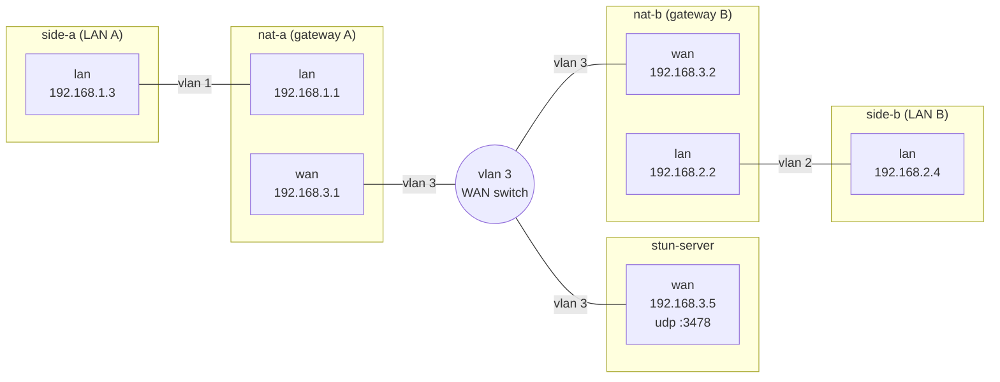

<h1 align="center">
  nat-traversal-rs
</h1>
<p align="center">
</p>

[](https://github.com/gabyx/socket-rs/releases/latest)
[](https://github.com/gabyx/socket-rs/actions/workflows/normal.yaml)
[](https://mit-license.org/)

## NAT Traversal Learning Exercise

This little learning experiment contains a Rust exectuble to learn how
NAT-traversal (a.k.a hole-punching) works. For the experiment we setup a NixOS
VM test with the following nodes:



The Rust executable runs on `side-a` and `side-b`. Each side sends a STUN
Binding Request over UDP to the STUN server running at `192.168.3.5:3478`. The
Binding Response contains the source address the server observed, which is the
side's reflexive (outward-facing) IP and port, as assigned by its NAT router
`nat-a` or `nat-b`.

The two sides then exchange their reflexive endpoints over a signaling channel.
In this test the channel is a file which each `side-a` & `side-b` have access
to. A real deployment would use a rendezvous server instead.

Once each side knows the other's endpoint, both sides send UDP datagrams to each
other at roughly the same time and keep retrying. An outbound datagram from
`side-a` to `side-b's` reflexive endpoint creates a connection-tracking
(`conntrack`) entry on `nat-a`. `nat-a` then accepts an inbound datagram only if
its source and destination match that entry's reply tuple, and only until the
entry expires (30 secs. for UDP without a reply). The same holds for `nat-b`.
The first datagrams may be dropped, because they can arrive before the receiving
side's NAT has an entry. After both sides have sent at least one datagram, each
NAT has an entry, and datagrams pass in both directions. At the stage the
NAT-traversal is done and a connection is established.

## Installation

```bash
just develop
# or
direnv reload
```

## Usage

To run the client side A:

```bash
just run --side a
```

and in another terminal run

```bash
just run --side b
```

## VM Tests

## Development

Read first the [Contribution Guidelines](/CONTRIBUTING.md).

For technical documentation on setup and development, see the
[Development Guide](docs/development-guide.md)

## Acknowledgement

Acknowledge all contributors and external collaborators here.

## Copyright

Add here your copyright statement.

## TODO

- Use nixnet
