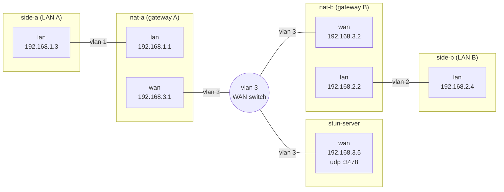
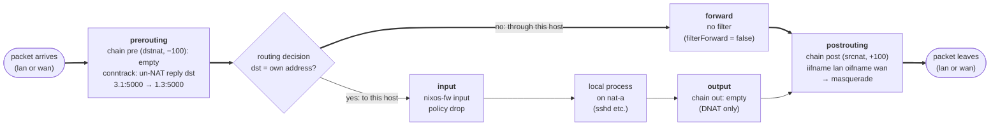
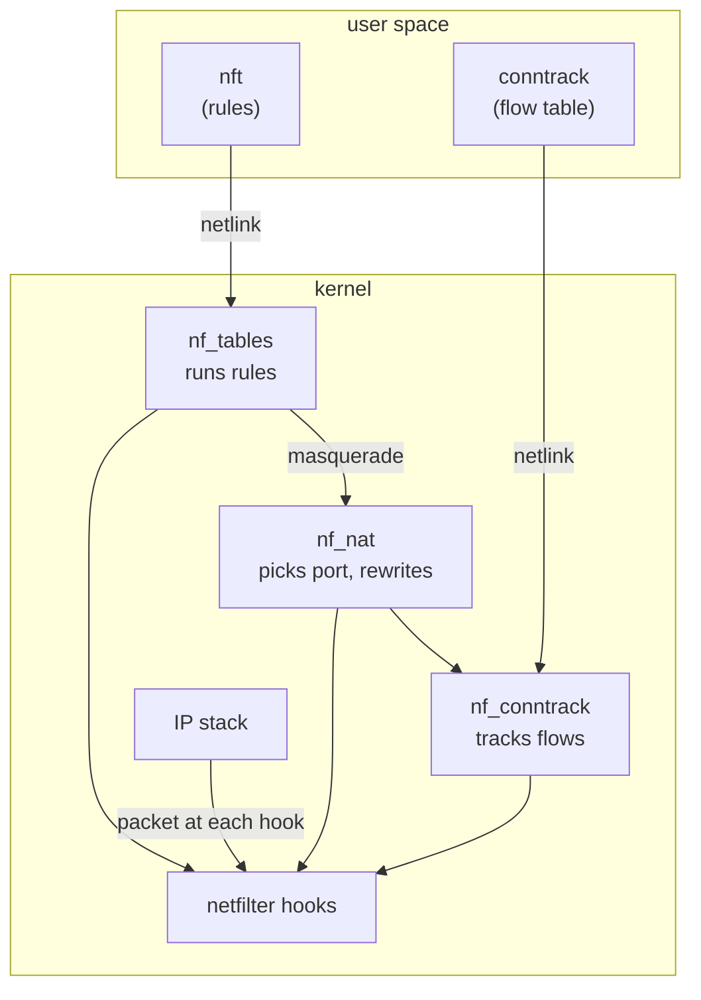

<h1 align="center">
  nat-traversal
</h1>
<p align="center">
</p>

[](https://github.com/gabyx/socket-rs/releases/latest)
[](https://github.com/gabyx/socket-rs/actions/workflows/normal.yaml)
[](https://mit-license.org/)

## NAT Traversal

This little **learning experiment** contains a Rust exectuble to learn how
NAT-traversal (a.k.a hole-punching) works based on this [nice article](https://tailscale.com/blog/how-nat-traversal-works). Most of the stuff here is handwritten and not AI generated. AI was only used for exploring the problem space.

For the experiment we setup a NixOS
VM test with the following nodes which are all NixOS configurations:



The Rust executable runs on `side-a` and `side-b`. Each side sends a STUN
Binding Request over UDP to the STUN server running at `192.168.3.5:3478`. The
Binding Response contains the source address the server observed, which is the
side's reflexive (outward-facing) IP and port, as assigned by its NAT router
`nat-a` or `nat-b`.

The two sides then exchange their reflexive endpoints over a signaling channel.
In this test the channel is a file which each `side-a` & `side-b` have access
to. A real deployment would use a rendezvous server instead.

Once each side knows the other's endpoint, both sides send UDP datagrams to each
other at roughly the same time and keep retrying. An outbound datagram from
`side-a` to `side-b's` reflexive endpoint creates a connection-tracking
(`conntrack`) entry on `nat-a`. `nat-a` then accepts an inbound datagram only if
its source and destination match that entry's reply tuple, and only until the
entry expires (30 secs. for UDP without a reply). The same holds for `nat-b`.
See `"net.netfilter.nf_conntrack_udp_timeout" = 30;" kernel boot options.` The
first datagrams may be dropped, because they can arrive before the receiving
side's NAT has an entry. After both sides have sent at least one datagram, each
NAT has an entry, and datagrams pass in both directions. At the stage the
NAT-traversal is done and a connection is established.

## NAT Nodes

Each NAT node (`nat-a` or `nat-b`) has the following settings:

```nix
networking.nat = {
  enable = true;
  internalInterfaces = [ "lan" ];
  externalInterface = "wan";
};
```

which will create a `nixos-nat` table for `nftable` queryable with
`nft list ruleset` as the following:

```text
table inet nixos-fw {...}

table ip nixos-nat {
  chain pre {
    type nat hook prerouting priority dstnat; policy accept; // <- This is the header of this chain.
    // No rules here.
  }

  chain post {
    type nat hook postrouting priority srcnat; policy accept;
    // One rule here: namely rewriting the source ip: "masquerade"
    iifname "lan" oifname "wan" masquerade comment "from internal interfaces"
  }

  chain out {
    type nat hook output priority mangle; policy accept;
    // No rules here.
  }
}
```

`nftables` is the successor of `iptables`. Both are front ends to the Linux
kernel's `netfilter` framework. Its configuration is a ruleset, which NixOS
generates in `/etc/nftables.conf`. Each chain in the ruleset is attached to one
of the netfilter hooks `prerouting`, `input`, `forward`, `output` and
`postrouting` (see `nft list hooks`). The kernel runs the chain for every packet
that passes that hook.



- `iifname "lan" oifname "wan" masquerade` applies to packets that enter on
  `lan` and leave on `wan`. For the first packet of a flow, it creates a NAT
  binding that rewrites the source address to the address of wan (192.168.3.1).
  If the source port is already used by another binding, the port is changed as
  well. Conntrack applies the binding to all later packets of the flow, and
  applies the inverse rewrite to the replies.

### Netfilter Tables Overview



## Installation

```bash
just develop
# or
direnv reload
```

## Usage

To run the client side A:

```bash
just run --side a
```

and in another terminal run

```bash
just run --side b
```

## VM Tests

Run the NixOS VM tests with:

```bash
just test-integration
```

## Development

Read first the [Contribution Guidelines](/CONTRIBUTING.md).

For technical documentation on setup and development, see the
[Development Guide](docs/development-guide.md)

## Acknowledgement

Acknowledge all contributors and external collaborators here.

## Copyright

Add here your copyright statement.

## TODO

- Use nixnet
